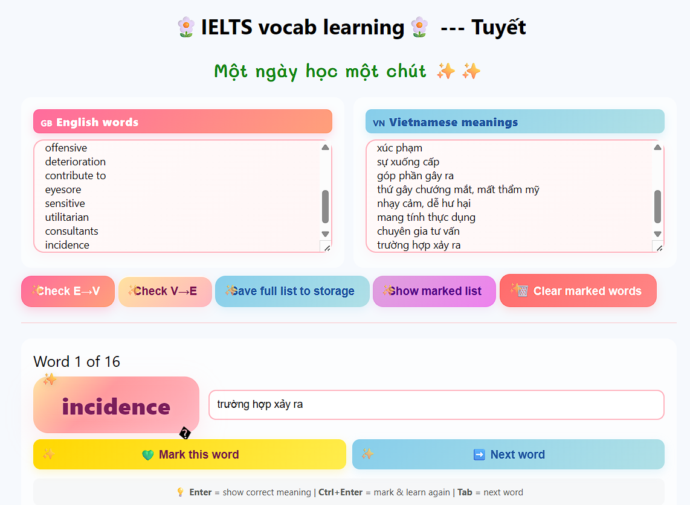

# Vocab Checker

Simple Node.js + Express app for entering English vocabulary lists, which helps users learn and practice vocabulary.

## Online version

Anyone with the link can use the app online at https://app-vocab.vercel.app/

## How to use



In the English word list, type or paste your vocabulary words, one word or phrase per line.

Example:

```text
phenomenon
predate
invaluable
archaeological
pervasive
priority
emulation
deface
offensive
deterioration
contribute to
eyesore
sensitive
utilitarian
consultants
incidence
```

In the Vietnamese meaning list, enter the matching Vietnamese meanings in the same order, one meaning per line.

Example:

```text
hiện tượng
có từ trước
vô giá, cực kỳ quý giá
thuộc khảo cổ học
lan rộng, phổ biến khắp nơi
ưu tiên hàng đầu
sự bắt chước
làm hư hỏng bề mặt, bôi bẩn
xúc phạm
sự xuống cấp
góp phần gây ra
thứ gây chướng mắt, mất thẩm mỹ
nhạy cảm, dễ hư hại
mang tính thực dụng
chuyên gia tư vấn
trường hợp xảy ra
```

Then choose either `Check E --> V` or `Check V --> E`.

The vocabulary items will be shown in random order. Enter the matching English word or Vietnamese meaning in the answer box, then click `Next`. If your answer is not correct, you can mark that word to review again by clicking `mark this word`.

Keyboard shortcuts:

- `Enter`: show correct meaning
- `Ctrl+Enter`: mark & learn again
- `Tab`: next word

Other features:

- `Save full list to storage`: save the current English and Vietnamese word lists to browser storage so you can reuse them later.
- `Show marked list`: show only the words you marked for extra review.
- `Clear marked words`: remove all words from the marked review list.

## Local development

Run:

```powershell
cd d:/app-vocab
npm install
npm start

# then open http://localhost:3000 in your browser
```

The UI accepts one vocab per line and saves to `data/vocabs.json`.
